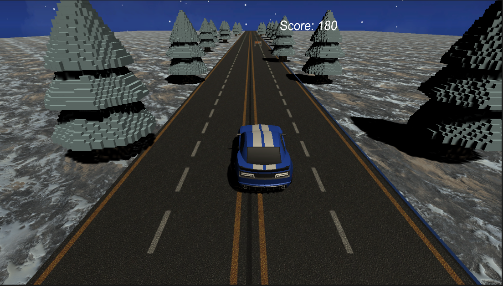

# Gosling Rider

Бесконечный раннер с кумиром молодого (почти нет) поколения. Главный герой, в котором каждый мужчина честный судьбы узнает себя.
- Windows
- Альбомная ориентация

## GDD

### Концепция
Бесконечный заезд на навороченной, оттюненной тачке -- это все стало реальность. Уворачивайтесь от внезапно появляющихся препятствий и наслаждайтесь космическими пейзажами.
### Визуальный стиль
Ультрареалистичный.

### Жизненный цикл
1. Нажали "Start" для начала игры
2. Управляем машинкой, уклоняемся от препятствий.
3. Игра завершается при столкновении с препятствием. Цель - набрать максимальное количество очков.
4. Возвращаемся к пункту 1.

### Механики и фичи

#### Core механики
- управление машинкой - двигаем её влево-вправо на кнопки A и D, уклоняемся от препятствий.
- очки - стараемся набрать как можно больше очков в игре и побить свои рекорды.

#### Additional механики
- добавить бонусы
    - защитные - иммунитет к столкновению с препятствием.
    - буст очков - на время увеличивать количество получаемых очков.
- добавить новые барьеры
    - добавить новые интересные препятствия (пока что это дорожный барьер и дорожный конус).
#### Juice механики
- чтобы можно было увидеть реального Гослинга в машинке.

## Билд
*Ссылка на архив с рабочим билдом под целевую платформу*

[Билд под Win](https://drive.google.com/file/d/1oE2ZX5m1h2943UiBjDg-bg7DRsVxSp--/view?usp=sharing)
